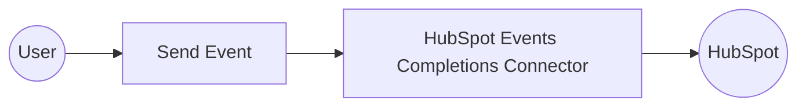

# Example

## What you'll build

This example builds an automation that sends a single custom behavioral event occurrence to HubSpot using the HubSpot Events Completions connector. The automation reports an event completion each time it runs and logs the resulting HTTP status code.

**Operations used:**
- **Send Event** : Sends a custom event occurrence to HubSpot for an existing custom event definition.

## Architecture

## Prerequisites

- A HubSpot access token, such as a Service Key, authorized with the `analytics.behavioral_events.send` scope.
- An existing custom event definition in your HubSpot account to report completions for.

## Setting up the HubSpot Events Completions integration

> **New to WSO2 Integrator?** Follow the [Create a New Integration](../../../../develop/create-integrations/create-a-new-integration.md) guide to set up your integration first, then return here to add the connector.

## Adding the HubSpot Events Completions connector

### Step 1: Open the connector palette

Select **Add Connection** in the **Connections** section.

### Step 2: Select the HubSpot Events Completions connector

1. Enter `hubspot.events.completions` in the search field.
2. Select the **HubSpot Events Completions** connector card.

## Configuring the HubSpot Events Completions connection

### Step 3: Bind the connection parameters to configurable variables

Bind the required connection field to a configurable variable.

- **Config** : The record that supplies the connector's authentication settings.

### Step 4: Save the connection

Select **Save** and verify that the connection appears in the **Connections** section.

### Step 5: Set actual values for your configurables

1. Select **Configurations** at the bottom of the project tree under **Data Mappers**.
2. Enter a value for each configurable listed below before you run the integration.

- **accessToken** (`string`) : The HubSpot access token used to authenticate connection requests.
- **eventName** (`string`) : The internal tracking ID of the custom event definition to report a completion for.

## Configuring the HubSpot Events Completions Send Event operation

### Step 6: Add an automation entry point

1. Select **Add Entry Point** next to **Entry Points**.
2. Select **Automation**.
3. Select **Create** to accept the settings.

### Step 7: Expand the connection and configure the Send Event operation

1. Select **Add Step** in the automation flow.
2. Expand **completionsClient** to display its operations.

3. Select **Send Event** and enter its required values.

- **Payload** : The event name, contact identifier, and custom properties for the event occurrence.

4. Select **Save**.

### Step 8: Log the Send Event result

Add a log action for the returned value, then return to the visual flow.

## Try it yourself

Try this sample in WSO2 Integration Platform.

[View source on GitHub](https://github.com/wso2/integration-samples/tree/main/integrator-default-profile/connectors/hubspot.events.completions_connector_sample)

## More code examples

The `hubspot.events.completions` connector provides practical examples illustrating usage in various scenarios. Explore these [examples](https://github.com/ballerina-platform/module-ballerinax-hubspot.events.completions/tree/main/examples/), covering the following use cases:

1. [Track customer purchase events](https://github.com/ballerina-platform/module-ballerinax-hubspot.events.completions/blob/main/examples/track_customer_purchase_events/track_customer_purchase_events.md) — Send a single purchase event in real time, then batch-report a set of accumulated page-view events.
