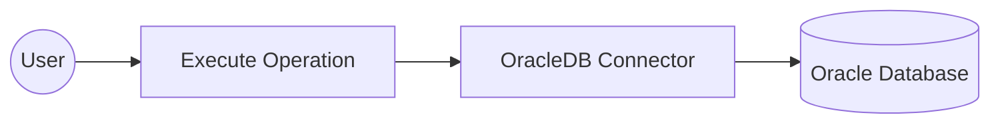
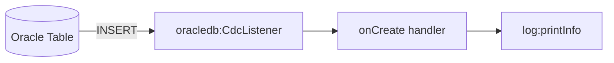

# Example

* **[OracleDB connector example](#oracledb-connector-example)**: Build an automation that executes a SQL INSERT against an Oracle database using the connector's `Client`.
* **[OracleDB CDC trigger example](#oracledb-cdc-trigger-example)**: React to row changes in an Oracle table in real time using the CDC listener and service model.

## OracleDB connector example

### What you'll build

Build an Oracle Database integration using the OracleDB connector in WSO2 Integrator's low-code canvas. The integration establishes an Oracle DB connection with configurable variables and executes a SQL INSERT statement to add a record to a database table.

**Operations used:**
- **execute**: Runs a SQL INSERT statement against the Oracle Database and returns an execution result.

### Architecture



### Prerequisites

- An Oracle Database instance accessible from the integration runtime.

### Setting up the OracleDB integration

> **New to WSO2 Integrator?** Follow the [Create a New Integration](../../../../develop/create-integrations/create-a-new-integration.md) guide to set up your integration first, then return here to add the connector.

### Adding the OracleDB connector

#### Step 1: Open the add connection palette

On the canvas, click **+ Add Connection** (or the **+** button in the Connections panel) to open the Add Connection palette, which shows available connectors.


#### Step 2: Search for and select the OracleDB connector

1. In the search box, type `oracledb` and press **Enter**.
2. Select **ballerinax/oracledb** from the results.

### Configuring the OracleDB connection

#### Step 3: Bind connection parameters to configurable variables

In the **Configure OracleDB** dialog, scroll down to the **Advanced Configurations** section and expand it. Bind each of the following fields to a Configurable variable so values can be supplied at runtime:

- **host** : The Oracle Database server hostname, bound to a string configurable
- **port** : The Oracle Database port number, bound to an int configurable
- **user** : The database username, bound to a string configurable
- **password** : The database password, bound to a string configurable
- **database** : The target database/service name, bound to a string configurable


#### Step 4: Save the connection

1. Scroll to the top of the dialog and verify the **Connection Name** is set to `oracledbClient`.
2. Click **Save**: the dialog closes and the `oracledbClient` connection node appears on the canvas.


#### Step 5: Set actual values for your configurables

1. In the left panel, click **Configurations** (at the bottom of the project tree, under Data Mappers).
2. Set a value for each configurable listed below:

- **oracleHost** : string : hostname or IP address of your Oracle Database server
- **oraclePort** : int : port on which Oracle Database listens (commonly 1521)
- **oracleDatabase** : string : Oracle service name or SID (for example, `ORCL`)
- **oracleUser** : string : database username
- **oraclePassword** : string : database password

### Configuring the OracleDB execute operation

#### Step 6: Add an automation entry point and expand the connection node

1. On the canvas, click **+ Add Entry Point** (or the **+** button in the Entry Points panel).
2. Select **Automation** from the entry point types: an Automation flow is added with **Start** and **End** nodes.
3. Click the **+** button between **Start** and **End** to open the step panel.
4. Expand **oracledbClient** in the connections list to see all available operations.


#### Step 7: Select and configure the execute operation

Under **oracledbClient**, click **execute** to open the Execute operation form, then fill in the fields:

- **SQL Query** : The SQL statement to run against the database (for example, an INSERT into the Employees table)
- **Result Variable Name** : The variable that stores the execution result (for example, `sqlExecutionresult`)
- **Result Type** : The type of the result variable (for example, `sql:ExecutionResult`)

Click **Save**.


### Try it yourself

Try this sample in WSO2 Integration Platform.

[](https://console.devant.dev/new?gh=wso2/integration-samples/tree/main/integrator-default-profile/connectors/oracledb_connector_sample)

[View source on GitHub](https://github.com/wso2/integration-samples/tree/main/integrator-default-profile/connectors/oracledb_connector_sample)

## OracleDB CDC trigger example

### What you'll build

Build an event-driven integration that reacts to new rows inserted into an Oracle table using the OracleDB connector's CDC listener. The `oracledb:CdcListener` streams row-level insert events to a service, which logs the captured row.

### Architecture



:::info Prerequisites
- An Oracle Database instance with `ARCHIVELOG` mode and supplemental logging enabled, and a CDC user with LogMiner privileges. See the [Setup Guide](setup-guide.md#enable-logminer-based-cdc-optional).
- A table to capture changes from (for example, `APP_USER.CUSTOMERS`, created in the [Setup Guide](setup-guide.md)).
:::

### Add the OracleDB CDC trigger

#### Open the artifacts palette

On the integration's **Overview** page, select **+ Add Artifact**, open the **Event Integration** category, and select the **CDC for Oracle DB** card.


### Configure the OracleDB CDC listener

#### Bind listener parameters to configurable variables

In the **Create Oracle CDC Integration** form, keep **Create new** selected and configure the **Listener Configurations**:

- **Listener Name**: keep the default, `oracledbListener`.
- **Host**, **Port**, **Database Name**, **Username**, **Password**: switch each to **Expression** and bind it to a configurable (`oracleHost`, `oraclePort`, `oracleDatabase`, `oracleUser`, `oraclePassword`).
- **Pluggable Database (PDB) Name**: leave empty for a legacy non-CDB Oracle instance.
- **Insert events**: keep enabled. Disable **Update events** and **Delete events** to keep this example focused on inserts.
- **Table**: enter the fully-qualified table name to capture, in `<database>.<schema>.<table>` format (for example, `FREEPDB1.APP_USER.CUSTOMERS`).


#### Set actual values for your configurations

Click **Create**. WSO2 Integrator creates the `oracledbListener` listener and a `CDC Oracle Service` with no event handlers yet.


Open **Configurations** in the project tree and set a value for each configurable: `oracleHost`, `oraclePort`, `oracleDatabase`, `oracleUser`, `oraclePassword`.

### Handle OracleDB CDC events

#### Add the onCreate handler

Click **+ Add Handler** and select **onCreate** — the handler fired when a new row is inserted into the captured table.


#### Define the entry type schema

In the **New onCreate Configuration** panel, select **Define Message Configuration** and use **Create Type Schema** to define the shape of the captured row:

1. Set **Name** to `OracleDBInsertEntry`.
2. Add a field `ID` of type `int`.
3. Add a field `NAME` of type `string`.


Save the type schema, then save the handler configuration.

#### Add a log step to the handler body

Open the generated `onCreate` remote function flow. Click the **+** node between **Start** and **Error Handler**, search for **Log Info**, and select it. Set **Msg** to an expression that serializes the captured row:

```ballerina
after.toJsonString()
```


#### Confirm the registered handler

Navigate back to the **CDC Oracle Service** view and confirm the `onCreate` event handler is registered alongside the listener and table name.


### Run the integration

Insert a row into the captured table to trigger the `onCreate` handler. You can do this in any of the following ways:

- **WSO2 Integrator DB client**: use the OracleDB connector's `Client.execute` action (see [OracleDB connector example](#oracledb-connector-example)) to run an `INSERT` statement.
- **`sqlplus` CLI**: connect with `sqlplus app_user/YourSecurePassword@<host>:<port>/<service_name>` and run an `INSERT` statement against the captured table.
- **Oracle SQL Developer / SQL Developer Web**: connect to the database and run an `INSERT` statement through the query editor.

The listener picks up the change and the `onCreate` handler logs the inserted row.

### Try it yourself

Try this sample in WSO2 Integration Platform.

[](https://console.devant.dev/new?gh=wso2/integration-samples/tree/main/integrator-default-profile/connectors/oracledb_trigger_sample)

[View source on GitHub](https://github.com/wso2/integration-samples/tree/main/integrator-default-profile/connectors/oracledb_trigger_sample)
