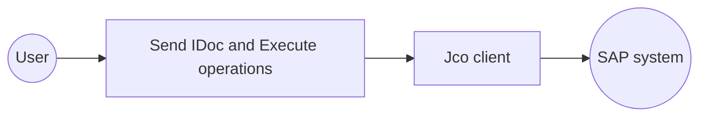
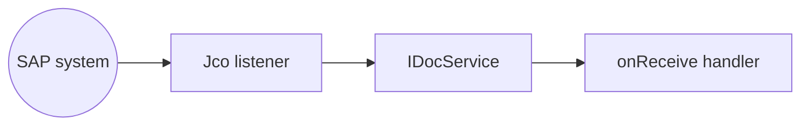

# Example

- [SAP JCo Client Example](#sap-jco-client-example)
- [SAP JCo Trigger Example](#sap-jco-trigger-example)

## SAP JCo Client Example

### What you'll build

Build an integration that connects to an SAP system with a SAP JCo (SAP Java Connector) client and performs two operations in a single automation: sending an IDoc and executing an RFC-enabled function module. Every SAP connection parameter is bound to a configurable variable.

**Operations used:**
- **Send IDoc (Intermediate Document)** : Sends an IDoc to the SAP system over tRFC.
- **Execute** : Calls an RFC-enabled function module on the SAP system and returns the response.

### Architecture

### Prerequisites

- An SAP system with a valid application server host, system number, client number, and logon credentials. See the [Setup Guide](setup-guide.md).
- The `sapjco3.jar` and `sapidoc3.jar` libraries, added manually to the project's `Ballerina.toml` as described in [Configure Ballerina.toml with JAR paths](setup-guide.md#configure-ballerinatoml-with-jar-paths). These proprietary libraries can't be bundled with the connector and must be obtained separately from the SAP Support Portal.

### Setting up the SAP JCo integration

> **New to WSO2 Integrator?** Follow the [Create a New Integration](../../../../develop/create-integrations/create-a-new-integration.md) guide to set up your integration first, then return here to add the connector.

### Adding the Jco connector

#### Step 1: Open the connector palette

1. In the WSO2 Integrator sidebar, select **+** next to **Connections** to open the **Add Connection** palette.
2. Enter `sap.jco` in the search field.

3. Select the **Jco** connector card.

### Configuring the Jco connection

#### Step 2: Bind the connection parameters to configurable variables

For each SAP credential, open the helper panel of the **Config** field, select the **Configurables** tab, select **+ New Configurable**, and save a `configurable string` variable for it. Then switch **Config** to expression mode and enter a `jco:DestinationConfig` cast referencing each configurable:

- **Config** : `<jco:DestinationConfig>{ashost: sapAshost, sysnr: sapSysnr, jcoClient: sapJcoClientNum, user: sapUsername, passwd: sapPassword}`, with `sapAshost`, `sapSysnr`, `sapJcoClientNum`, `sapUsername`, and `sapPassword` each bound to a configurable variable. The explicit cast resolves the type ambiguity between `DestinationConfig` and the raw property-map alternative.

#### Step 3: Save the connection

Select **Save Connection**. The **Connections** section now lists `jcoClient` as an available connection in the project.

#### Step 4: Set actual values for your configurables

1. In the left panel, select **Configurations**.
2. Enter a value for each configurable listed below.

- **sapAshost** (`string`) : The SAP application server host name.
- **sapSysnr** (`string`) : The two-digit SAP system number.
- **sapJcoClientNum** (`string`) : The three-digit SAP client number.
- **sapUsername** (`string`) : The SAP logon user name.
- **sapPassword** (`string`) : The SAP logon password.

### Configuring the Jco Send IDoc and Execute operations

#### Step 5: Add an automation entry point

Select **+** next to **Entry Points**, select **Automation**, and select **Create** to accept the default name (`main`). The flow canvas opens with **Start** and **Error Handler** nodes.

#### Step 6: Expand the connection and select Send IDoc

Select **+** on the flow canvas, then expand `jcoClient` under **Connections** to display its operations: **Execute**, **Send IDoc**, and **Close**.

Select **Send IDoc** to open the `jcoClient → sendIDoc` form, then enter:

- **IDoc** : An IDoc XML payload, for example an `ORDERS05` document with an `EDI_DC40` control record segment.

Select **Save**. The `jco : sendIDoc` node connects between **Start** and **Error Handler**.

#### Step 7: Add and configure the Execute operation

Select the **+** node between `jco : sendIDoc` and **Error Handler**, expand `jcoClient` again, and select **Execute** to open the `jcoClient → execute` form. Enter:

- **Function Name** : The RFC function module to call, for example `STFC_CONNECTION`.
- **Result** : The variable name to store the response in, for example `executeResult`.
- **Return Type** : `xml`, to receive the raw response instead of a typed record.
- **Parameters** (under **Advanced Configurations**) : Select `importParameters`, then add `REQUTEXT` as the key and `Hello SAP` as the value.

Select **Save**. The `jco : execute` node connects between `jco : sendIDoc` and **Error Handler**.

#### Step 8: Log the Execute result

Add a **Log Info** step after `jco : execute`, setting its **Msg** field to `"RFC execute result"` with `result` set to `executeResult`.

### Try it yourself

Try this sample in WSO2 Integration Platform.

[View source on GitHub](https://github.com/wso2/integration-samples/tree/main/integrator-default-profile/connectors/sap.jco_client_connector_sample)

## SAP JCo Trigger Example

### What you'll build

Build an integration that reacts to IDocs pushed from an SAP system. A `jco:Listener` registers as a JCo server with the SAP gateway, and an `IDocService` handles every inbound IDoc through an `onReceive` callback, logging its content, with a separate `onError` callback for framework-level errors.

**Operations used:**
- **onReceive** : Invoked when an IDoc is received from the SAP system.
- **onError** : Invoked when a framework-level error occurs.

### Architecture

### Prerequisites

- An SAP system with a program ID registered for inbound connections via transaction SM59, and an SAP gateway host and service reachable from the integration. Complete the [program ID registration](setup-guide.md#register-a-program-id-for-inbound-connections) and [IDoc partner profile](setup-guide.md#configure-idoc-partner-profile) setup.
- The `sapjco3.jar` and `sapidoc3.jar` libraries, added manually to the project's `Ballerina.toml` as described in [Configure Ballerina.toml with JAR paths](setup-guide.md#configure-ballerinatoml-with-jar-paths). These proprietary libraries can't be bundled with the connector and must be obtained separately from the SAP Support Portal.

### Setting up the SAP JCo integration

> **New to WSO2 Integrator?** Follow the [Create a New Integration](../../../../develop/create-integrations/create-a-new-integration.md) guide to set up your integration first, then return here to add the trigger.

### Adding the SAP JCo trigger

#### Step 1: Open the Artifacts palette and configure the listener

Select **+ Add Artifact**, then select the **SAP JCo** card in the **Event Integration** category. The **Create SAP JCo Event Integration** form opens.

For each field, open its helper panel, select the **Configurables** tab, select **+ New Configurable**, and save a `configurable string` variable for it.

- **Listener Name** : A name for the listener, for example, `jcoListener`.
- **Gateway Host** : The SAP gateway host to register the server with, bound to a configurable variable.
- **Gateway Service** : The SAP gateway service name or port, bound to a configurable variable.
- **Program ID** : The program ID registered in the SAP system via transaction SM59, bound to a configurable variable.

#### Step 2: Configure the repository destination and select the service type

With **Destination Configurations** selected, bind the remaining fields to configurable variables:

- **Application Server Host** : The SAP application server host name.
- **System Number** : The SAP system number.
- **Client Number** : The SAP client number.
- **User** : The SAP logon user name.
- **Password** : The SAP logon password.
- **Service Type** : Select **IDocService**. This walkthrough receives IDocs; for inbound RFC calls, select **RfcService** and use the [Trigger Reference](trigger-reference.md#service).

#### Step 3: Set actual values for your configurations

1. In the left panel, select **Configurations**.
2. Enter a value for each configurable listed below.

- **gwHost** (`string`) : The SAP gateway host.
- **gwService** (`string`) : The SAP gateway service name or port.
- **progId** (`string`) : The program ID registered via transaction SM59.
- **sapAshost** (`string`) : The SAP application server host name.
- **sapSysnr** (`string`) : The SAP system number.
- **sapJcoClientNum** (`string`) : The SAP client number.
- **sapUsername** (`string`) : The SAP logon user name.
- **sapPassword** (`string`) : The SAP logon password.

#### Step 4: Create the listener and service

Select **Create**. The listener and `IDocService` are registered, and the Service view opens with `onReceive` and `onError` event handlers listed.

### Handling SAP JCo events

#### Step 5: Log the received IDoc in onReceive

Select **onReceive** to open its flow canvas, select the **+** node, and select **Log Info**. Set its **Msg** field, in expression mode, to `"Received IDoc: " + iDoc.toString()`.

Select **Save**, then select the back arrow to return to the Service view.

#### Step 6: Log the error in onError

Select **onError** to open its flow canvas, select the **+** node, and select **Log Error**. Set its **Msg** field to `"Error processing IDoc"`, then expand **Advanced Configurations** and set **Error** to `err`.

Select **Save**.

### Running the integration

#### Step 7: Run the integration and dispatch a test IDoc

1. Select **Run** to start the integration, and wait for the listener to register with the SAP gateway.
2. From the SAP system, dispatch an IDoc to the registered program ID, for example, using the [Client Example](#sap-jco-client-example)'s Send IDoc operation or an equivalent SAP outbound process.
3. Confirm the IDoc content appears in the integration's log output.

### Try it yourself

Try this sample in WSO2 Integration Platform.

[View source on GitHub](https://github.com/wso2/integration-samples/tree/main/integrator-default-profile/connectors/sap.jco_trigger_sample)

## More code examples

The `Ballerina SAP JCo Connector` provides practical examples illustrating usage in various scenarios. Explore these
scenarios to understand how to automate processes involving SAP systems and external data sources using Ballerina.

1. [SAP Inventory Update via RFC](https://github.com/ballerina-platform/module-ballerinax-sap.jco/tree/main/examples/sap_inventory_update) - Integrate external inventory data into an SAP system and
   update inventory records through an RFC.

2. [Automate IDoc Dispatch](https://github.com/ballerina-platform/module-ballerinax-sap.jco/tree/main/examples/idoc_automation) - Demonstrate the automation of generating and dispatching IDocs for
   shipment details.

3. [Automated Supplier Order Processing via IDoc Listener](https://github.com/ballerina-platform/module-ballerinax-sap.jco/tree/main/examples/order_idoc_listener) - Set up an IDoc listener to automate
   supplier order processing.

4. [SAP Product Catalog Sync](https://github.com/ballerina-platform/module-ballerinax-sap.jco/tree/main/examples/sap_product_catalog) - Query SAP material master data using RFC table parameters
   (filter criteria and field selection) and sync the results to an external product catalog API.

5. [SAP Real-Time Credit Check Service](https://github.com/ballerina-platform/module-ballerinax-sap.jco/tree/main/examples/sap_credit_check_service) - Expose a Ballerina service as an inbound RFC
   server that SAP calls synchronously during sales order creation to validate customer creditworthiness.
