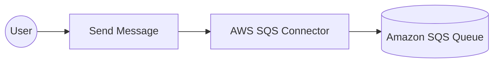

# Example

## What you'll build

In this guide, you'll create an integration that sends a message to an Amazon SQS queue using the AWS SQS connector. The integration uses configurable variables for authentication and queue details, keeping credentials separate from the integration logic.

**Operations used:**
- **Send Message** : Delivers a message to a specified SQS queue

## Architecture

## Prerequisites

- An AWS account with access to Amazon SQS
- An IAM user with SQS permissions and its access key ID and secret access key
- An existing SQS queue URL

## Setting up the AWS SQS integration

> **New to WSO2 Integrator?** Follow the [Create a New Integration](../../../../develop/create-integrations/create-a-new-integration.md) guide to set up your integration first, then return here to add the connector.

## Adding the AWS SQS connector

### Step 1: Open the connector palette

Select **Add Connection** in the **Connections** section.

### Step 2: Select the AWS SQS connector

1. Enter `aws.sqs` in the search field.
2. Select the **SQS** connector card.

## Configuring the AWS SQS connection

### Step 3: Bind the connection parameters to configurable variables

Switch the **Auth** field to **Expression** mode and enter a record expression that references two configurable variables for the access key ID and secret access key. Switch the **Region** field to **Expression** mode and bind it to a configurable variable.

- **Auth** : Authentication configuration with static credentials for the AWS account
- **Region** : AWS region where the SQS queue is hosted

### Step 4: Save the connection

Select **Save Connection** and verify that the connection appears in the **Connections** section.

### Step 5: Set actual values for your configurables

1. Select **Configurations** at the bottom of the project tree under **Data Mappers**.
2. Enter a value for each configurable listed below before you run the integration.

- **accessKeyId** (`string`) : AWS IAM access key ID for authentication
- **secretAccessKey** (`string`) : AWS IAM secret access key for authentication
- **region** (`string`) : AWS region identifier such as `us-east-1`
- **queueUrl** (`string`) : Full URL of the target SQS queue

## Configuring the AWS SQS Send Message operation

### Step 6: Add an automation entry point

1. Select **Add Entry Point** next to **Entry Points**.
2. Select **Automation**.
3. Select **Create** to accept the settings.

### Step 7: Expand the connection and configure the Send Message operation

1. Select the **+** node in the automation flow.
2. Expand **sqsClient** to display its operations.

3. Select **Send Message** and enter its required values.

- **Queue Url** : URL of the Amazon SQS queue to which the message is sent
- **Message Body** : Content of the message to deliver to the queue

4. Select **Save**.

### Step 8: Log the Send Message result

Add a log action for the returned value, then return to the visual flow.

## Try it yourself

Try this sample in WSO2 Integration Platform.

[View source on GitHub](https://github.com/wso2/integration-samples/tree/main/integrator-default-profile/connectors/aws_sqs_connector_sample)

## More code examples

The `ballerinax/aws.sqs` connector provides practical examples illustrating usage in various scenarios. Explore these [examples](https://github.com/ballerina-platform/module-ballerinax-aws.sqs/tree/master/examples):

1. [**Basic Queue Consumer**](https://github.com/ballerina-platform/module-ballerinax-aws.sqs/tree/master/examples/basic-queue-consumer) – Demonstrates creating a standard SQS queue, sending messages, and consuming them using a Ballerina listener.
2. [**Basic Queue Operations**](https://github.com/ballerina-platform/module-ballerinax-aws.sqs/tree/master/examples/basic-queue-operations) – Shows how to create a queue, send, receive, and delete messages, and delete the queue.
3. [**Advanced Messaging Features**](https://github.com/ballerina-platform/module-ballerinax-aws.sqs/tree/master/examples/advanced-messaging-features) – Demonstrates advanced messaging features such as message attributes, batch sending, and custom queue attributes.
4. [**FIFO Queue**](https://github.com/ballerina-platform/module-ballerinax-aws.sqs/tree/master/examples/fifo-queue) – Shows how to work with FIFO queues, including sending messages with different `messageGroupId`s and grouping received messages.
