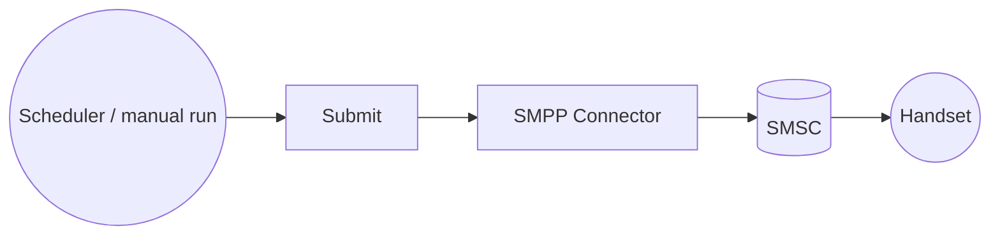

# Example

## What you'll build

This example builds an automation that connects to an SMSC over SMPP and sends one SMS to a phone number. The connection binds the SMSC host, system ID, and password to configurable variables, so you can point the same integration at any carrier or aggregator without editing the flow. The automation requests a delivery receipt, then logs the message ID the SMSC assigned.

**Operations used:**
- **Submit** : Sends a text message to one destination (`submit_sm`) and returns the SMSC's message ID.

## Architecture



## Prerequisites

- An SMSC, carrier, or aggregator account that exposes SMPP v3.4, reachable from your machine on its SMPP port (`2775` is the common default)
- The bind credentials for that account: the system ID and password
- A bind type of `TRANSMITTER` or `TRANSCEIVER` for the account, since the automation sends messages

See the [Setup Guide](setup-guide.md) for how to obtain these from your provider.

## Setting up the SMPP integration

> **New to WSO2 Integrator?** Follow the [Create a New Integration](../../../../develop/create-integrations/create-a-new-integration.md) guide to set up your integration first, then return here to add the connector.

## Adding the SMPP connector

### Step 1: Open the connector palette

1. Select **Add Artifact** on the integration's **Design** view.
2. Under **Other Artifacts**, select **Connection**.

### Step 2: Select the SMPP connector

1. Enter `smpp` in the **Search connectors** field.
2. Select the **Smpp** connector card.

> **Note:** The search also returns **Smpp Caller**, which is used inside a listener service to reply on the session a message arrived on. Select **Smpp** to create a client connection.


## Configuring the SMPP connection

### Step 3: Bind the connection parameters to configurable variables

Switch each field to **Expression** mode and select **Configurables** in the expression editor to create a configurable variable for it, rather than typing a literal. Keep credentials out of the flow so they never reach source control.

- **Host** : The SMSC host name or IP address. Bind it to `smscHost`.
- **System Id** : The SMPP `system_id` (username) used to bind. Bind it to `systemId`.
- **Password** : The password used to bind. Bind it to `password`.
- **Advanced Configurations** : Expand this to set the port (bind it to `smscPort`) and set **Bind Type** to `TRANSMITTER`, since this automation only sends.
- **Connection Name** : Enter `smppClient`. The flow references the connection by this name.


### Step 4: Save the connection

Select **Save** and verify that `smppClient` appears as a connection on the **Design** view.


### Step 5: Set actual values for your configurables

1. Select **Configure** at the top of the integration view.
2. Enter a value for each configurable listed below before you run the integration.

- **smscHost** (`string`) : Host name or IP address of the SMSC.
- **smscPort** (`int`) : The SMSC's SMPP port. Defaults to `2775`.
- **systemId** (`string`) : The system ID the SMSC issued for your account.
- **password** (`string`) : The password for that system ID.
- **destinationNumber** (`string`) : The recipient's number in international format without a leading `+`, for example `94771234567`.

## Configuring the SMPP Submit operation

### Step 6: Add an automation entry point

1. Select **Add Artifact** and then **Automation**.
2. Select **Create** to accept the settings.

### Step 7: Expand the connection and configure the Submit operation

1. Open the automation and select **+** on the flow line after **Start** to open the node panel.
2. Under **Connections**, expand **smppClient** to display its operations.


3. Select **Submit** and enter its required values.

- **Sms** : The message to send. Use **Expression** mode and enter the record below. It addresses the message to the `destinationNumber` configurable and asks the SMSC for a delivery receipt.

  ```ballerina
  {
      destinationAddress: destinationNumber,
      shortMessage: "Hello from WSO2 Integrator!",
      registeredDelivery: smpp:ON_SUCCESS_OR_FAILURE
  }
  ```

- **Result** : Enter `result`. The SMSC's message ID is returned in `result.messageId`.


4. Select **Save**.

### Step 8: Log the Submit result

Add a **Log Info** step after the operation with the message `SMS submitted to the SMSC`, and add `result.messageId` as an additional value so the ID can be correlated with the delivery receipt later. The completed flow binds to the SMSC when the integration starts, submits the message, and logs the message ID.


## More code examples

The `smpp` module provides practical examples illustrating usage in various scenarios.

1. [Send an SMS](https://github.com/ballerina-platform/module-ballerina-smpp/tree/main/examples/send-sms) – Binds a transmitter client, submits a single text message with a delivery-receipt request, and prints the message ID the SMSC returns.

2. [Receive SMS and delivery receipts](https://github.com/ballerina-platform/module-ballerina-smpp/tree/main/examples/receive-sms) – Binds a receiver listener and logs every inbound message and delivery receipt, including the receipt's final status.

3. [Two-way SMS short code](https://github.com/ballerina-platform/module-ballerina-smpp/tree/main/examples/two-way-sms) – Binds a transceiver listener that answers a balance-enquiry keyword by replying on the same session through the `Caller`.
