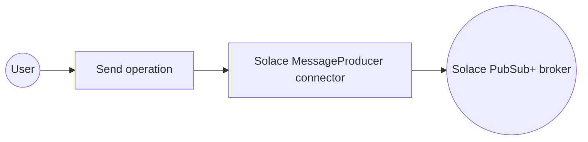
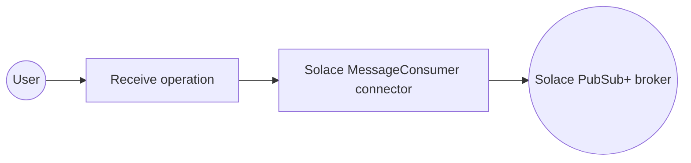
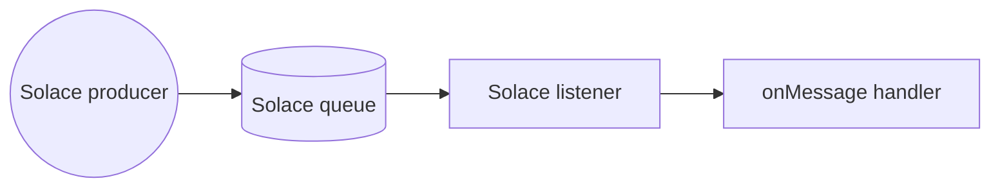

# Example

- [Solace Producer Example](#solace-producer-example)
- [Solace Consumer Example](#solace-consumer-example)
- [Solace Trigger Example](#solace-trigger-example)

## Solace Producer Example

### What you'll build

Build an integration that publishes a message to a Solace PubSub+ topic using the WSO2 Integrator low-code visual designer. The integration connects to a Solace broker with a `Message Producer` connection and sends a message to a topic, with every connection parameter bound to a configurable variable.

**Operations used:**
- **Send** : Publishes a message to the configured Solace destination.

### Architecture

### Prerequisites

- A running Solace PubSub+ broker accessible over a broker URL, with a message VPN, username, and password. See the [Setup Guide](setup-guide.md).

### Setting up the Solace MessageProducer integration

> **New to WSO2 Integrator?** Follow the [Create a New Integration](../../../../develop/create-integrations/create-a-new-integration.md) guide to set up your integration first, then return here to add the connector.

### Adding the Solace MessageProducer connector

#### Step 1: Open the connector palette

1. In the WSO2 Integrator sidebar, select **+** next to **Connections** to open the **Add Connection** palette.
2. Enter `solace` in the search field.

3. Select the **Solace MessageProducer** card.

### Configuring the Solace MessageProducer connection

#### Step 2: Bind the connection parameters to configurable variables

For each field, open its helper panel, select the **Configurables** tab, select **+ New Configurable**, and save a `configurable string` variable for it.

- **Url** : The Solace broker URL, bound to a configurable variable.
- **Auth** : The authentication configuration; enter `{username: solaceUsername, password: solacePassword}` in expression mode, referencing configurable variables for both fields.

#### Step 3: Save the connection

Select **Save Connection**. The **Connections** section now lists `solaceMessageproducer` as an available connection in the project.

#### Step 4: Set actual values for your configurables

1. In the left panel, select **Configurations**.
2. Enter a value for each configurable listed below.

- **solaceUrl** (`string`) : The Solace broker URL, for example, `tcp://localhost:55554`.
- **solaceUsername** (`string`) : Username for basic authentication.
- **solacePassword** (`string`) : Password for basic authentication.
- **solaceTopicName** (`string`) : The topic to publish messages to.

### Configuring the Solace MessageProducer Send operation

#### Step 5: Add an automation entry point

Select **+** next to **Entry Points**, select **Automation**, and select **Create** to accept the default name (`main`). The flow canvas opens with **Start** and **Error Handler** nodes.

#### Step 6: Expand the connection and select Send

Select **+** on the flow canvas, then expand `solaceMessageproducer` under **Connections** to display its operations.

#### Step 7: Configure the Send operation

Select **Send** to open the `solaceMessageproducer → send` form, then enter:

- **Message** : A `solace:Message` record; set the `payload` field to `"Hello from Solace!"`.
- **Destination** : `{topicName: solaceTopicName}`.

#### Step 8: Save the operation

Select **Save**. The `solace : send` node connects between **Start** and **Error Handler** in the automation flow.

### Try it yourself

Try this sample in WSO2 Integration Platform.

[View source on GitHub](https://github.com/wso2/integration-samples/tree/main/integrator-default-profile/connectors/solace_message_producer_connector_sample)

## Solace Consumer Example

### What you'll build

Build an integration that connects to a Solace broker with a `Message Consumer` connection and receives a single message from a queue. This example uses the WSO2 Integrator low-code canvas to configure the connection and the receive operation visually.

**Operations used:**
- **Receive** : Receives a message from the configured Solace queue, blocking until a message arrives or the call times out.

### Architecture

### Prerequisites

- A running Solace PubSub+ broker with a durable queue already provisioned. See the [Setup Guide](setup-guide.md); durable queues aren't created automatically.

### Setting up the Solace MessageConsumer integration

> **New to WSO2 Integrator?** Follow the [Create a New Integration](../../../../develop/create-integrations/create-a-new-integration.md) guide to set up your integration first, then return here to add the connector.

### Adding the Solace MessageConsumer connector

#### Step 1: Open the connector palette

1. In the WSO2 Integrator sidebar, select **+** next to **Connections** to open the **Add Connection** palette.
2. Enter `solace` in the search field.

3. Select the **Solace MessageConsumer** card.

### Configuring the Solace MessageConsumer connection

#### Step 2: Bind the connection parameters to configurable variables

- **Auth** : Enter `{username: solaceUsername, password: solacePassword}` in expression mode, referencing configurable variables for both fields.
- **Subscription Config** : Enter `{queueName: solaceQueueName}` in expression mode, referencing a configurable variable for the queue name.

#### Step 3: Save the connection

Select **Save Connection**. The **Connections** section now lists `solaceMessageconsumer` as an available connection in the project.

#### Step 4: Set actual values for your configurables

1. In the left panel, select **Configurations**.
2. Enter a value for each configurable listed below.

- **solaceUrl** (`string`) : The Solace broker URL, for example, `tcp://localhost:55554`.
- **solaceUsername** (`string`) : Username for basic authentication.
- **solacePassword** (`string`) : Password for basic authentication.
- **solaceQueueName** (`string`) : The queue to receive messages from. The queue must already exist on the broker.

### Configuring the Solace MessageConsumer Receive operation

#### Step 5: Add an automation entry point

Select **+** next to **Entry Points**, select **Automation**, and select **Create** to accept the default name (`main`). The flow canvas opens with **Start** and **Error Handler** nodes.

#### Step 6: Expand the connection and select Receive

Select **+** on the flow canvas, then expand `solaceMessageconsumer` under **Connections** to display its operations. Select **Receive** to open the `solaceMessageconsumer → receive` form.

#### Step 7: Configure the Receive operation

This operation has no required parameters. Enter the following optional values:

- **Result** : The variable name to store the received message in.
- **T** : A narrowed message type, for example, `record {|*Message; T payload;|}`, to bind the payload to a specific type. Leave this as `solace:Message` to receive the raw message.

#### Step 8: Save the operation and log the result

Select **Save** to add the `solace : receive` node to the flow. Add a **Log Info** step after it, logging the received message.

### Try it yourself

Try this sample in WSO2 Integration Platform.

[View source on GitHub](https://github.com/wso2/integration-samples/tree/main/integrator-default-profile/connectors/solace_message_consumer_connector_sample)

## Solace Trigger Example

### What you'll build

Build an integration that reacts to messages arriving on a Solace queue. A `solace:Listener` subscribes to the queue and dispatches every message to an `onMessage` handler, which deserializes the payload into an `OrderMessage` record and logs it as a JSON string.

**Operations used:**
- **onMessage** : Invoked when a message is received on the subscribed queue.

### Architecture

### Prerequisites

- A running Solace PubSub+ broker with a durable queue already provisioned, and a client username with permission to consume from it. See the [Setup Guide](setup-guide.md).

### Setting up the Solace integration

> **New to WSO2 Integrator?** Follow the [Create a New Integration](../../../../develop/create-integrations/create-a-new-integration.md) guide to set up your integration first, then return here to add the trigger.

### Adding the Solace trigger

#### Step 1: Open the Artifacts palette and configure the listener

Select **+ Add Artifact**, then select the **Solace Event Integration** card in the **Event Integration** category. The **Create Solace Event Integration** form opens.

For each field, open its helper panel, select the **Configurables** tab, select **+ New Configurable**, and save a `configurable string` variable for it.

- **Listener Name** : A name for the listener, for example, `solaceListener`.
- **Broker URL** : The Solace broker URL, bound to a configurable variable.
- **Message VPN** : The message VPN to connect to. Defaults to `default`.
- **Basic Authentication** : Select this option, then bind **Username** and **Password** to configurable variables.

#### Step 2: Configure the destination and acknowledgement mode

Scroll down and configure the remaining fields:

- **Queue** : Select this destination type.
- **Queue Name** : The queue to consume messages from, bound to a configurable variable. The queue must already exist on the broker.
- **Acknowledgement Mode** : Leave this at the default **Auto Ack**.

#### Step 3: Set actual values for your configurations

1. In the left panel, select **Configurations**.
2. Enter a value for each configurable listed below.

- **solaceHost** (`string`) : The Solace broker URL.
- **solaceUsername** (`string`) : The client username with permission to consume from the queue.
- **solacePassword** (`string`) : The password for the client username.
- **solaceQueueName** (`string`) : The name of the queue to consume messages from.

#### Step 4: Create the listener and service

Select **Create**. The listener and service are registered, and the Service view opens with an empty **Event Handlers** list.

### Handling Solace events

#### Step 5: Add the onMessage handler

Select **+ Add Handler**. The **Select Handler to Add** panel lists the available handlers for this trigger.

Select **onMessage**.

#### Step 6: Define the message type

In the **New onMessage Configuration** panel, select **Define Value**, then select the **Create Type Schema** tab. Enter `OrderMessage` as the type name and add an `orderId` field of type `string`. Select **Save** to create the type.

Select **Save** again to open the flow canvas for the `onMessage` remote function.

#### Step 7: Log the received message

Add a **Log Info** step to the flow, and set its **Msg** field to `message.toJsonString()`.

Select **Save**, then select the back arrow to return to the Service view.

#### Step 8: Confirm the handler is registered

The **Event Handlers** list now shows the registered `onMessage` handler.

### Running the integration

#### Step 9: Run the integration and publish a test message

1. Select **Run** to start the integration, and wait for the listener to connect to the broker.
2. Publish a test message to the same queue, for example, with a Solace MessageProducer integration built from the [producer example](#solace-producer-example), or from the broker's **Try Me** tool in PubSub+ Manager.
3. Confirm the message payload appears in the integration's log output as a JSON string.

### Try it yourself

Try this sample in WSO2 Integration Platform.

[View source on GitHub](https://github.com/wso2/integration-samples/tree/main/integrator-default-profile/connectors/solace_trigger_sample)

## More code examples

The `ballerinax/solace` connector provides practical examples illustrating usage in various scenarios. Explore these [examples](https://github.com/ballerina-platform/module-ballerinax-solace/tree/main/examples), covering the following use cases:

1. [Order Fulfillment](https://github.com/ballerina-platform/module-ballerinax-solace/tree/main/examples/order-fulfillment) - Send orders to a queue and process them with `CLIENT_ACK` mode. Shows point-to-point (queue) messaging where a message is only acknowledged once it has been fulfilled successfully, so a worker that crashes beforehand picks it back up on restart.

2. [Live Price Alerts](https://github.com/ballerina-platform/module-ballerinax-solace/tree/main/examples/live-price-alerts) - Publish stock price updates to hierarchical topics and raise alerts only for significant moves. Shows publish/subscribe (topic) messaging with a topic wildcard and direct (at-most-once) delivery.

3. [Transactional Inventory Sync](https://github.com/ballerina-platform/module-ballerinax-solace/tree/main/examples/transactional-inventory-sync) - Apply inventory deltas from a queue within a transacted session, rolling back and safely discarding a bad update instead of corrupting inventory state. Shows transacted consumption with `commit`/`rollback`.

4. [Payment Processing](https://github.com/ballerina-platform/module-ballerinax-solace/tree/main/examples/payment-processing) - Reject an invalid payment outright while retrying one that hits a simulated transient failure. Shows negative acknowledgement (`nack`) and the difference between rejecting a message to the dead message queue and requeuing it for redelivery.
