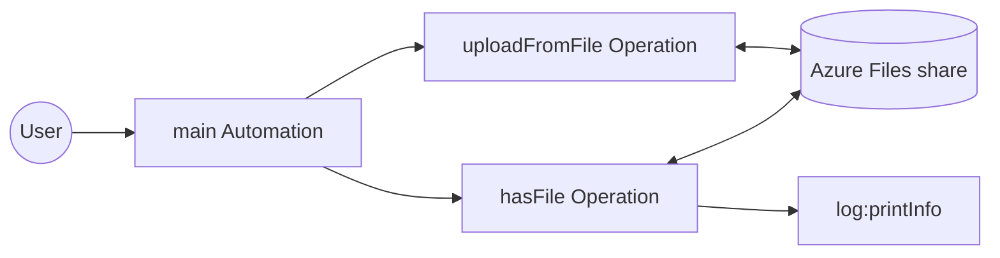
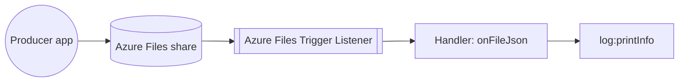

# Example

## Azure Files example

### What you'll build

Build a WSO2 Integrator automation that connects to an Azure file share, uploads a local report with the `uploadFromFile` operation, and confirms the upload with the `hasFile` operation. The workflow uses configurable variables to manage the Azure credentials securely.

**Operations used:**
- **uploadFromFile** : Uploads a local file to a path on the share.
- **hasFile** : Checks whether a file exists at a share path.

### Architecture

### Prerequisites

- An Azure storage account with a file share (see the [Setup Guide](setup-guide.md))
- The storage account name and an access key

### Setting up the integration

> **New to WSO2 Integrator?** Follow the [Create a New Integration](../../../../develop/create-integrations/create-a-new-integration.md) guide to set up your integration first, then return here to add the connector.

#### Step 1: Add an Automation entry point

A new integration starts with no artifacts, so the sidebar stays empty and connections cannot be added yet. Create the entry point first:

1. Select **+ Add Artifact** on the canvas toolbar.
2. Under **Automation**, select the **Automation** tile.
3. Select **Create Integration**. No additional configuration is needed.

An **Automation** entry point appears in the sidebar under **Entry Points**, and the design view shows the automation node. Selecting the node opens the automation flow editor with a **Start** node.

### Creating the configurable variables

The connection form references configurable variables for the share name and credentials, so create the variables first.

#### Step 2: Create configurable variables

1. In the sidebar, select **Configurations** to open the **Configurable Variables** view.
2. Select **+ Add Config**, enter the **Variable Name**, keep the **Variable Type** as `string`, leave **Default Value** empty, and select **Save**. Repeat for each variable listed below.

- **accountName** (string) : The Azure storage account name
- **accountKey** (string) : An access key of the storage account
- **shareName** (string) : The name of the file share to bind the client to

### Adding the Azure Files connector

Select **Add Connection** in the WSO2 Integrator sidebar to open the connector palette.

#### Step 3: Open the connector palette and select the Files connector

1. In the WSO2 Integrator sidebar, expand **Connections** and select the **+** button next to it.
2. In the connector palette search box, enter `azure.storage.files`.
3. The palette lists three cards under `ballerinax / azure.storage.files`: **Files** (the share client this example uses), **Files Admin** (the account-level `AdminClient`), and **Files Caller** (passed to trigger handlers, not used as a connection). Select the **Files** card.

### Configuring the Azure Files connection

#### Step 4: Bind connection parameters to the configurable variables

Selecting the **Files** card opens the **Configure Files** form. Switch **Share Name** to **Expression** and enter `shareName`, switch **Auth** to **Expression** and enter `{accountName, accountKey}`, and set **Connection Name** to `azFilesClient`.

#### Step 5: Save the connection

Select **Save Connection** to persist the connection. The form closes and `azFilesClient` appears in the sidebar under **Connections**.

#### Step 6: Set actual values for your configurables

1. In the left panel, select **Configurations**.
2. Set a value for each configurable listed below.

- **accountName** (string) : Your storage account name, from the [Setup Guide](setup-guide.md)
- **accountKey** (string) : An access key of the storage account
- **shareName** (string) : The file share to work with (for example, `reports`)

### Configuring the uploadFromFile operation

#### Step 7: Select the uploadFromFile operation and configure its parameters

1. In the sidebar under **Entry Points**, select **Automation** to open its flow editor (selecting the automation node in the design view works too).
2. Select the **+** button on the canvas between **Start** and **Error Handler**.
3. In the right-side node panel, expand **Connections → azFilesClient**.

4. Select **Upload From File** and fill in the operation form:

- **Source Path** : The local file to upload (for example, `./data/q1-report.pdf`)
- **Destination Path** : The full share path to upload to, including the file name (for example, `/reports/q1-report.pdf`)

5. Select **Save**.

#### Step 8: Confirm the upload and log the result

1. Select the **+** below the **Upload From File** node and add the **Has File** operation from **Connections → azFilesClient**. Set **Path** to the destination path from Step 7 (`/reports/q1-report.pdf`) and name the result variable `uploaded` (its type is fixed to `boolean`).
2. Add a **Log Info** statement below it with the expression ``string `${uploaded}` `` (the message must be a string, so the boolean is interpolated).

`hasFile` returns `true` once the file is present on the share, so the log output confirms the upload.

### Try it yourself

Try this sample in WSO2 Integration Platform.

[View source on GitHub](https://github.com/wso2/integration-samples/tree/main/integrator-default-profile/connectors/azure.storage.files_connector_sample)

---

## Azure Files trigger example

### What you'll build

This integration watches a drop folder on an Azure file share and processes each JSON file dropped into it. When a `.json` file arrives on the watched path, the `onFileJson` handler fires with the parsed content and logs it, and the listener deletes the file after successful processing; a file that fails to parse moves to a `/failed` directory instead.

### Architecture

### Prerequisites

- An Azure storage account with a file share containing an `/incoming` directory (see the [Setup Guide](setup-guide.md))
- The storage account name and an access key

### Setting up the integration

> **New to WSO2 Integrator?** Follow the [Create a New Integration](../../../../develop/create-integrations/create-a-new-integration.md) guide to set up your integration first, then return here to add the trigger.

### Configuring the Azure Files listener

#### Step 1: Create configurable variables

In the left panel, select **Configurations**. In the Configurable Variables panel, select **+ Add Config** and create each configuration listed below. If you completed the client example in the same project, these variables already exist; reuse them and skip this step.

- **accountName** (string) : The Azure storage account name
- **accountKey** (string) : An access key of the storage account
- **shareName** (string) : The file share to watch

### Adding the Azure Files trigger

#### Step 2: Select the Azure Files integration type

1. Select the **+** button in the WSO2 Integrator side panel header to open the **New Integration** wizard (on an empty project, the **+ Add Integration or Library** button in the project view opens the same wizard), and continue to the **Type** step.
2. Scroll to the **File Integration** category, select the **Azure Files** card, and select **Next**.

#### Step 3: Configure the listener

The **Azure Files Integration** page opens with the **Listener Configurations** form (the trigger polls through a listener). Fill it referencing the configurables:

- **Listener Name** : `azFilesListener`
- **Share Name** : Switch to **Expression** and enter `shareName`
- **Select the authentication method** : **Shared Key**
- **Account Name** : Switch to **Expression** and enter `accountName`
- **Account Key** : Switch to **Expression** and enter `accountKey`
- **Monitoring Path** : `/incoming`. This is the watched path the service attaches to; `/` watches the share root.

#### Step 4: Create the trigger

Select **Create** to generate the listener and the service. A `files:Service` entry appears in the sidebar under **Entry Points**.

The listener polls every 60 seconds by default. To make the example respond faster, select `azFilesListener` under **Listeners** and set **Polling Interval** to a smaller value, for example `5`.

### Setting configuration values

#### Step 5: Set actual values for your configurations

In the left panel, select **Configurations** again, and set a value for each configuration created above:

- **accountName** (string) : Your storage account name
- **accountKey** (string) : An access key of the storage account
- **shareName** (string) : The file share to watch

### Handling file events

#### Step 6: Add a file handler

Return to the integration service view (select **files:Service** under **Entry Points**) and select **+ Add Handler**. The handler picker offers **On Create**, which fires for files appearing on the monitoring path; select it. The handler's **Format** setting then selects how the content is delivered: **JSON**, **XML**, **CSV**, **Text**, or **Raw Bytes**, generating the `onFileJson`, `onFileXml`, `onFileCsv`, `onFileText`, or `onFile` callback respectively. An `onError` handler for poll, read, and content-binding failures can be added in code; see the [Trigger Reference](trigger-reference.md). Note that declaring one moves the disposal of content-binding failures onto `onError`'s own `@files:FunctionConfig`, so the **On Error** action configured here would no longer apply to them.

#### Step 7: Configure the JSON handler

In the **New On Create Configuration** panel, set:

- **Format** : **JSON**, so the handler receives the parsed content
- **After File Processing → On Success** : **Delete**, so a processed file is removed from the drop folder
- **After File Processing → On Error** : **Move** with **Move To** `/failed`, so a file that cannot be parsed leaves the watched path instead of firing again on every poll. (This service declares no `onError` handler, so the binding failure is disposed of by this action.)

These options generate the `onFileJson` handler carrying the `@files:FunctionConfig` annotation's `afterProcess` and `afterError` actions. See the [Trigger Reference](trigger-reference.md) for the full annotation surface.

Select **Save** to register the `onFileJson` handler on the service.

#### Step 8: Add a log statement to the handler

After the handler is saved, WSO2 Integrator opens the handler's flow canvas. The handler receives the parsed file content as an input named `content` of type `json`.

1. Select the **+** inside the handler flow and choose **Log Info** from the **Logging** section in the side panel.
2. In the expression editor, select `content` from the **Inputs** list, then append `.toJsonString()`.

#### Step 9: Verify the final service view

Navigate back to the integration service view. The handler section now displays the registered `onFileJson` handler.

### Running the integration

Select **Run Integration** in the WSO2 Integrator toolbar to start the integration. To fire a test event, drop a `.json` file into the watched directory:

1. In the [Azure portal](https://portal.azure.com/), open your storage account and navigate to **Data storage** > **File shares**.
2. Open the share, browse into the `incoming` directory, and select **Upload** to add a small `.json` file.

On the next poll (every 60 seconds by default, or the interval you set on the listener), the `onFileJson` handler fires and logs the parsed content to the console, and the listener deletes the file from the drop folder. A malformed `.json` file moves to `/failed` instead, because this service declares no `onError` handler.

### Try it yourself

Try this sample in WSO2 Integration Platform.

[View source on GitHub](https://github.com/wso2/integration-samples/tree/main/integrator-default-profile/connectors/azure.storage.files_trigger_sample)

## More code examples

The Azure Files connector provides practical examples illustrating usage in various scenarios. Explore these [examples](https://github.com/ballerina-platform/module-ballerinax-azure.storage.files/tree/main/examples), covering file backup, SAS handouts, and share-driven file processing.

1. [File backup](https://github.com/ballerina-platform/module-ballerinax-azure.storage.files/tree/main/examples/file-backup) - Continuously back up a local folder: a directory listener watches it and uploads every new file to a file share.
2. [Share handout](https://github.com/ballerina-platform/module-ballerinax-azure.storage.files/tree/main/examples/share-handout) - Upload a report and generate a time-limited, read-only SAS URL to share with a third party.
3. [Drop folder processor](https://github.com/ballerina-platform/module-ballerinax-azure.storage.files/tree/main/examples/drop-folder-processor) - Watch a folder on a share with the listener and process each dropped file.
4. [Change tracker](https://github.com/ballerina-platform/module-ballerinax-azure.storage.files/tree/main/examples/change-tracker) - A schedulable program that diffs a share against the snapshot saved by its previous run and logs created, modified, and deleted events.
